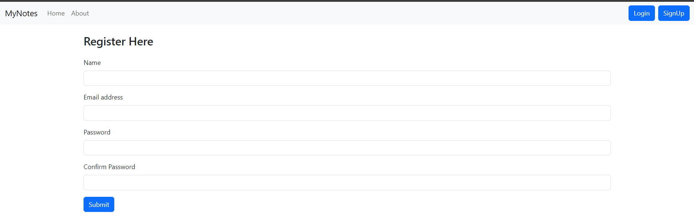
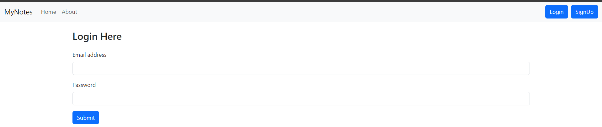
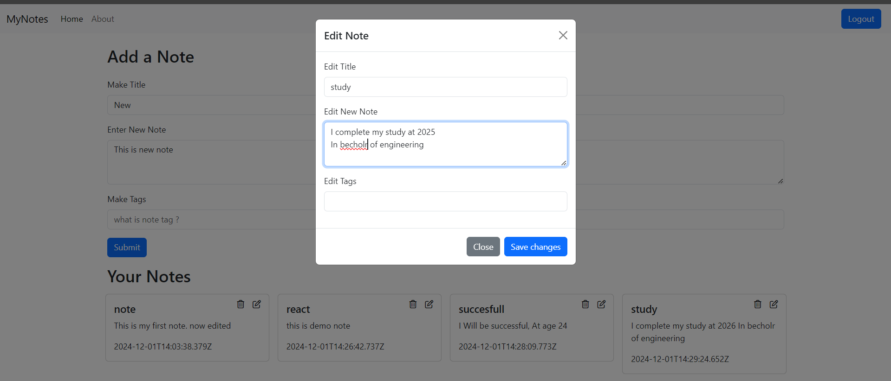

# MyNotes - Note-Taking Application

**MyNotes** is a **React.js** application with a **Node.js** and **MongoDB** backend. It provides users with a secure platform to manage their personal notes. Each user can register, log in, create notes, view their notes, edit them, and delete them. The application ensures that each user has access only to their own notes.

---

## Features

### **Authentication**
- **User Registration**: Create a new account with a unique email and password.
- **User Login**: Log in securely to access your notes.

### **Note Management**
- **Create Notes**: Add new notes with ease.
- **View Notes**: See a list of all your personal notes.
- **Edit Notes**: Modify existing notes as needed.
- **Delete Notes**: Remove notes that are no longer required.

### **Backend Features**
- **API for CRUD Operations**: The backend, built using **Node.js**, provides secure APIs for creating, reading, updating, and deleting notes.
- **MongoDB Integration**: All user data and notes are stored securely in a MongoDB database.
- **Multi-User Support**: Each user can see only their own notes, ensuring data privacy.

### **Responsive Design**
- Fully optimized for use on desktops, tablets, and mobile devices.

---

## How to Run the Project

### Frontend Setup
1. **Download the Project**
   - Clone or download the built React.js frontend files to your local machine.

2. **Host the Project**
   - Open the frontend project folder in **VS Code**.
   - Use the **Live Server Extension** to host the project:
     - Install the **Live Server Extension** in VS Code (if not already installed).
     - Right-click the `index.html` file in the project folder and select **Open with Live Server**.

3. **Access the Application**
   - The app will open in your default web browser.

### Backend Setup
1. **API Setup**
   - The backend is built using **Node.js** and requires **MongoDB**.
   - Host the backend on a live server or localhost. Ensure that it is connected to a MongoDB instance.

2. **Connect Frontend to Backend**
   - Update the frontend with the correct API base URL in the configuration file.

---

## Usage Instructions

1. **Register and Log In**: Create an account or log in using your credentials.
2. **Manage Notes**:
   - Add new notes.
   - View, edit, or delete your notes.
3. **Data Privacy**:
   - Your notes are private and secure. Other users cannot see or modify your notes.

---

## Technologies Used

### Frontend
- **React.js**: For building the user interface.
- **CSS**: For responsive design and styling.

### Backend
- **Node.js**: For backend development.
- **Express.js**: To create RESTful APIs.
- **MongoDB**: For storing user data and notes.

---

## Screenshots

### Register Page

### Login Page

### User Dashboard

### Edit Note Page

---

## Future Enhancements

- **Search Notes**: Add functionality to search through notes.
- **Rich Text Editor**: Enable advanced note formatting options.
- **Tagging System**: Allow users to tag notes for better organization.

---

## Contributing

Contributions are welcome! Feel free to fork the repository, make changes, and submit a pull request.

---

## License

This project is licensed under the **MIT License**.
